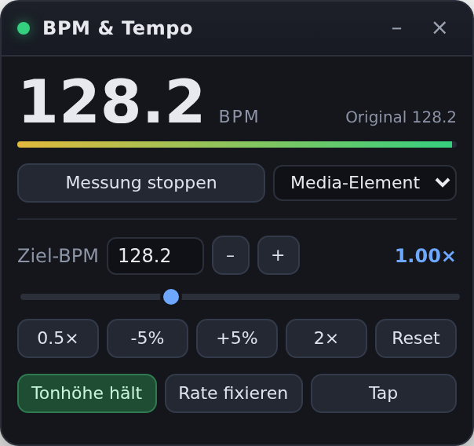

# BPM Meter & Tempo Control

Chrome-Extension (Manifest V3), die bei YouTube, SoundCloud, Bandcamp, Mixcloud &
Co. die **BPM des gerade laufenden Audios misst** und das **Tempo per UI
verändern** lässt – wahlweise mit gehaltener Tonhöhe oder im Plattenspieler-Modus.



## Installation

1. `chrome://extensions` öffnen, **Entwicklermodus** einschalten.
2. **Entpackte Erweiterung laden** → diesen Ordner (`bpm-extension`) auswählen.

## Bedienung

1. Track starten (YouTube, SoundCloud, beliebige Seite mit `<audio>`/`<video>`).
2. Auf das Extension-Icon klicken (oder **Alt+B**) → Panel erscheint auf der Seite.
3. **Messung starten** – nach ein paar Sekunden steht die BPM-Zahl.
4. Tempo ändern:
   * **Ziel-BPM** eintippen oder mit **–/+** in 1-BPM-Schritten schieben,
   * **Rate-Slider** bzw. **0.5× / -5% / +5% / 2×**,
   * **Reset** stellt 1.00× wieder her und gibt die Referenz-BPM wieder frei.

Weitere Schalter:

| Schalter | Wirkung |
| --- | --- |
| **Tonhöhe hält** | `preservesPitch` – Tempo ändern ohne Pitch-Shift (Standard). Aus = Plattenspieler-Feeling, Tonhöhe wandert mit. |
| **Rate fixieren** | Setzt die Rate nach Track-/Playerwechsel automatisch wieder (YouTube setzt sie sonst auf 1.0 zurück). |
| **Tap** | Im Takt klicken – setzt die Referenz-BPM manuell, falls die Erkennung mal danebenliegt. |
| **Tab-Audio / Media-Element** | Audioquelle der Messung, siehe unten. |

Das Panel ist verschiebbar (Kopfzeile ziehen), minimierbar und merkt sich seine
Position. Das Popup am Icon spiegelt Anzeige und wichtigste Regler.

### Tab-Audio vs. Media-Element

* **Tab-Audio** (Standard) nimmt den kompletten Ton des Tabs ab (`chrome.tabCapture`).
  Funktioniert überall – auch bei Playern in iframes und bei CORS-geschützten
  Streams. Muss über Icon-Klick oder Alt+B gestartet werden, weil Chrome dafür
  `activeTab` verlangt. Der Ton läuft weiter, er wird intern wieder ausgegeben.
* **Media-Element** hängt sich direkt an das `<audio>`/`<video>`-Element
  (etwas geringere Latenz). Die Extension erlaubt das nur bei unbedenklichen
  Quellen (`blob:`, gleiche Origin, `crossorigin`-Attribut) – bei fremden
  Streams würde `createMediaElementSource()` die Seite dauerhaft stummschalten.

Die Tempo-Steuerung selbst braucht keine Messung und keine Berechtigung: Sie
wirkt direkt auf alle Media-Elemente der Seite, auch in iframes.

## Wie die Erkennung arbeitet

1. **Onset-Hüllkurve**: Spectral Flux aus dem `AnalyserNode`, in drei Bänder
   (40–250 Hz, 250 Hz–2 kHz, 2–8 kHz) getrennt und je auf ihre Bandbreite
   normiert gewichtet (0.5/0.3/0.2). Ohne diese Gewichtung übertönen die vielen
   Höhen-Bins den Kick, der den Takt trägt – dann rastet die Erkennung gern auf
   der Achtel-Ebene ein.
2. **Aufbereitung**: gleitendes Mittel abziehen, halbwellig gleichrichten,
   leicht glätten (sonst rastet die Autokorrelation auf ganzzahligen Lags ein
   und liegt um bis zu 1 % daneben), normieren.
3. **Tempo**: Autokorrelation über 60–200 BPM, verstärkt um ihre Harmonischen
   (l, 2l, 3l), gewichtet mit einem Tempo-Prior um 135 BPM.
4. **Feinschliff**: Onset-Spitzen mit Subframe-Genauigkeit suchen, ihnen
   Schlagnummern zuordnen und eine gewichtete Gerade `t = t0 + k·L`
   hindurchlegen → ~0.1 % Genauigkeit über ein 10-Sekunden-Fenster.
5. **Halftime-Korrektur**: Wechseln sich starke und schwache Schläge regelmäßig
   ab, ist der echte Puls halb so schnell (typisch für HipHop/Trap).
6. **Stabilisierung**: Über die letzten Schätzungen wird die größte
   übereinstimmende Gruppe gemittelt; daraus entsteht auch der Konfidenzbalken.

Angezeigt wird immer *Referenz-BPM × Rate*, also das, was gerade zu hören ist.
Sobald du das Tempo veränderst, wird die Referenz eingefroren – die Anzeige
bleibt damit stabil, statt der eigenen Tempoänderung hinterherzulaufen.

### Grenzen

* Erkennungsbereich 68–200 BPM. Was darüber liegt, wird oktaviert gefaltet.
* Die Oktav-Frage (70 vs. 140) ist musikalisch nicht immer eindeutig – bei
  dichten Achteln oder sehr schnellen Stücken kann die Anzeige auf einem
  verwandten Puls landen. **2× / 0.5×** oder **Tap** korrigieren das.
* Freie Rhythmik, Sprache, Live-Mitschnitte ohne klaren Beat: niedrige Konfidenz.
* In Hintergrund-Tabs drosselt Chrome die Wiedergabe-Pipeline; für die Messung
  sollte der Tab im Vordergrund sein.
* Sehr starke Tempoänderungen (> ±25 %) mit gehaltener Tonhöhe klingen wegen
  Chromes Time-Stretching artefaktreich – das ist Chrome, nicht die Extension.

## Berechtigungen

| Berechtigung | Wofür |
| --- | --- |
| `activeTab` | Zugriff auf den Tab, in dem du die Extension aufrufst |
| `tabCapture` | Tab-Audio für die Messung |
| `storage` | Panel-Position, Tonhöhen-Einstellung |
| `scripting` | Nachladen des Content-Scripts auf bereits offenen Seiten |

Es wird **nichts** übertragen, aufgezeichnet oder gespeichert: Die Analyse läuft
komplett lokal im Tab, der Audiostrom wird nur zur Ausgabe zurückgereicht.

## Tests

```bash
node tools/test-tempo.mjs        # Tempo-Schätzer gegen synthetische Hüllkurven
node tools/e2e/run-e2e.cjs       # echter Analyzer im Chromium, 128-BPM-Click-Track
node tools/e2e/run-extension.cjs # geladene Extension: Panel, Messaging, iframes
```

Die beiden E2E-Tests brauchen `playwright` (`npm i -g playwright`) und `python3`
(erzeugt den Click-Track). `run-e2e.cjs` prüft die gemessenen BPM bei
Abspielraten von 0.7× bis 1.25× (Toleranz 2 %), `run-extension.cjs` lädt die
Extension wirklich in Chromium und prüft Panel, Nachrichtenwege und die
Tempoänderung bis ins iframe.

Icons neu erzeugen: `python3 tools/make-icons.py`.

## Aufbau

```
manifest.json
src/background/service-worker.js   Vermittlung Popup <-> Panel <-> Frames, Tab-Capture
src/content/common.js              Namespace, Einstellungen, Messaging-Helfer
src/content/media.js               Media-Elemente finden und steuern (jeder Frame)
src/content/analyzer.js            Audiograph + BPM-Erkennung
src/content/ui.js                  Panel im Shadow-DOM
src/content/main.js                Zustand, verbindet alles
src/popup/                         Popup am Icon
tools/                             Icon-Generator und Tests
```
